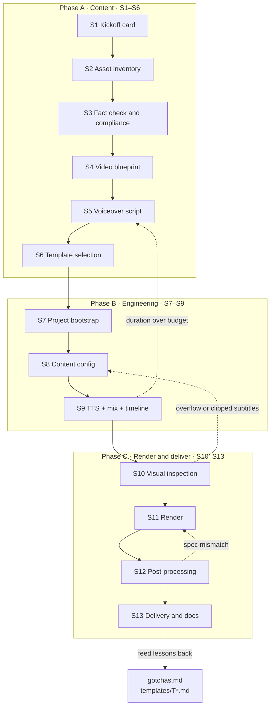
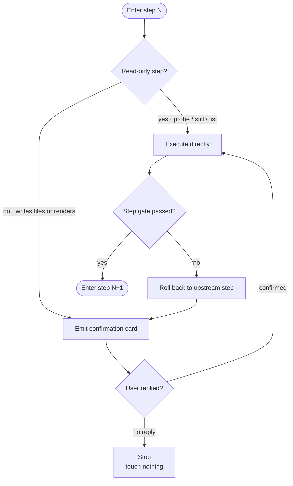
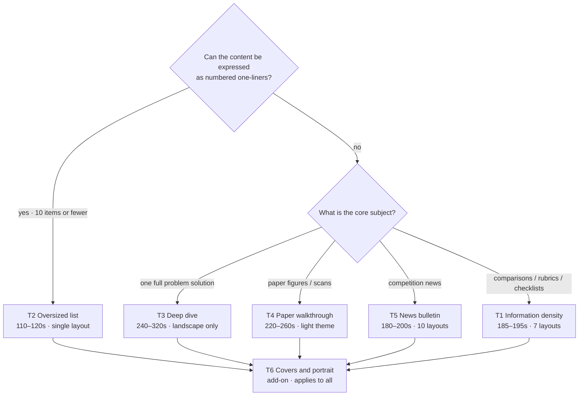
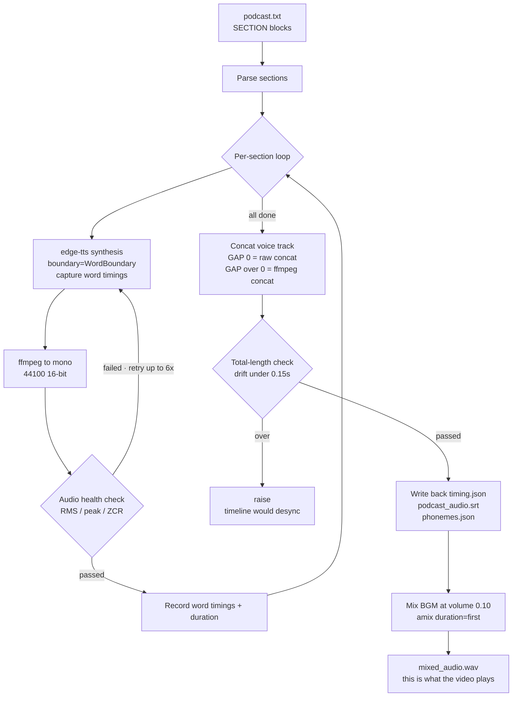
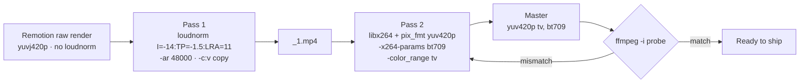

# mcm-video-pipeline

> A production pipeline for math-modeling (MCM/CUMCM) explainer videos — 13 gated steps, 6 reusable templates, and a mandatory confirmation gate before every step.

**English** | [中文](README.md)

An Agent Skill that captures a real, working video production line. It is not a prompt collection — it fixes *what each step must produce, what the parameters are, which steps are non-skippable, and what has already gone wrong*.

Every number in here is a **measured value** taken from shipped videos (episodes 12 and 13 of a long-running series, several special editions, and a competition-news episode).

---

## Table of contents

- [The problem it solves](#the-problem-it-solves)
- [Pipeline overview](#pipeline-overview)
- [The confirmation gate](#the-confirmation-gate)
- [The 13 steps](#the-13-steps)
- [Template library](#template-library)
- [Voiceover and timeline pipeline](#voiceover-and-timeline-pipeline)
- [Two mandatory post-processing passes](#two-mandatory-post-processing-passes)
- [Stack and key parameters](#stack-and-key-parameters)
- [Known pitfalls](#known-pitfalls)
- [Repository layout](#repository-layout)
- [Quick start](#quick-start)

---

## The problem it solves

Producing a 3-minute explainer video has a lopsided cost profile:

| Stage | Real time | Cost of redoing |
|---|---|---|
| Topic + blueprint | 30 min | **5 min to change the outline** |
| Voiceover script | 1 h | ~1 h (re-script + re-TTS + re-render) |
| TTS + timeline | 10 min | ~5 min |
| Render | 5–10 min | ~10 min |
| Post-process + delivery | 30 min | ~30 min |

**The money is in the blueprint; the landmines are in post.** So the pipeline makes two design choices:

1. **Move the blueprint forward and make it a hard gate** — S4 is not approved, no script gets written.
2. **Make the two post-processing passes a delivery gate** — no `loudnorm`, no `bt709`, not done.

---

## Pipeline overview




Solid arrows move forward; dotted arrows are rollback paths. Note that **every rollback points at an upstream content step**, not at a re-render.

| Phase | Steps | Question it answers | Key artifacts |
|---|---|---|---|
| **A · Content** | S1–S6 | What are we saying? | Kickoff brief, asset list, fact table, `视频思路.md`, `podcast.txt`, chosen template |
| **B · Engineering** | S7–S9 | How do we build it? | Remotion project, `episode_data.ts`, `timing.json`, `mixed_audio.wav` |
| **C · Render & deliver** | S10–S13 | How do we ship it? | Probe frames, landscape MP4, normalized master, 4 delivery docs |

---

## The confirmation gate

**This is what separates the pipeline from a plain prompt template.**

Before each step starts, the Agent must emit a **confirmation card** and wait for the user's reply. No reply means no file is touched.




### The card has a fixed four-line shape

```
[S<N> · <step name>]
What I'll do: <one line, naming the files/dirs involved>
What I need from you: <numbered list, or "none">
My recommendation: <default + one reason, so "1" is enough to proceed>
Optional forks: <A / B / C, only when there is a real choice>
```

### Three supporting rules

1. **One step per turn.** Don't run S4–S9 straight through and then ask. Don't put two steps on one card.
2. **Offer defaults, don't ask open questions.** "Trim the script to 1040 characters?" beats "How do you want to handle the duration?"
3. **Name the paths before any write/render/overwrite.** Rendering and `loudnorm` are re-encodes that overwrite same-named files.

### Exempt: read-only operations

Reading files, `ffmpeg -i` probes, `npx remotion compositions`, extracting frames into a temp dir — these run without asking.

---

## The 13 steps

| Step | Name | Gate / key output |
|---|---|---|
| **S1** | Kickoff card | 8 fields: episode id, one-line positioning, series continuity, target duration, output specs, voice + rate, urgency, asset sources |
| **S2** | Asset inventory | Has/missing list: problem PDF, paper, figures, rule text, BGM, code/results |
| **S3** | Fact check & compliance | `claim → source → verbatim quote → tier` table. **Rules content must be checked against the official text.** |
| **S4** | Video blueprint | `视频思路.md` with the scene outline table. **No script until the outline is approved.** |
| **S5** | Voiceover script | `podcast.txt` split by `[SECTION:name]` |
| **S6** | Template selection | Pick T1–T6 and load its spec |
| **S7** | Project bootstrap | Copy the Remotion skeleton, fix 3 paths, `npm install`, smoke test |
| **S8** | Content config | `episode_data.ts` + cover copy. Section names must match `podcast.txt`. |
| **S9** | TTS + mix + timeline | `timing.json`, `mixed_audio.wav`. **Audio health check + total-length check must pass.** |
| **S10** | Visual inspection | Probe frames; render log `overflow` must be 0 |
| **S11** | Render | Landscape first (portrait only on request) |
| **S12** | Post-processing | `loudnorm` + `bt709`; must probe as `yuv420p(tv, bt709)` |
| **S13** | Delivery & docs | Finished files + 4 documents, values recorded truthfully |

### Duration tiers (measured)

| Tier | Duration | Script length | Scenes | Template |
|---|---|---|---|---|
| Quick hit | 110–120 s | 620–700 chars | 8–10 | T2 |
| Series standard | 185–195 s | 1180–1230 chars | 9–11 | T1 / T5 |
| Deep dive | 240–320 s | 1500–2000 chars | 6–10 | T3 / T4 |

Budget formula: **~5.6 chars/sec for long sentences, ~6.5 for short ones** (Chinese), then adjust for the TTS `RATE` (+28% raises the ceiling by ~6%).

### Handling an over-budget duration

Order matters and must not be reversed:

1. Trim ~7% of the script (cut repeated transitions, merge similar list items)
2. Then raise `RATE` from `+20%` to `+28%`
3. Still too long → go back to S4 and cut a scene

**Never just raise the rate.** It compresses the audio to the point of being hard to follow, and higher rates make the TTS misread Chinese numerals more often.

Measured: episode 12 was 221 s against a 190 s target → trimmed ~7% + raised rate → 189.65 s. Episode 13 went from 1410 chars / 217.8 s down to ~1040 chars / 185.28 s.

---

## Template library

Six templates, all with a **shipped source project** behind them.

| ID | File | Positioning | Duration | Scenes | Reference |
|---|---|---|---|---|---|
| **T1** | `templates/T1-深空学术-信息密度.md` | Multi-layout, high information density; the series workhorse | 185–195 s | 9–11 | Ep.12 189.65 s, Ep.13 185.40 s |
| **T2** | `templates/T2-大字清单-紧迫.md` | Single layout, oversized numerals; fastest to scan | 110–120 s | 8–10 | Pre-competition edition 111.51 s |
| **T3** | `templates/T3-真题长拆解.md` | One past problem, all sub-questions, end to end | 240–320 s | 6–10 | Special A 286.37 s, B 319.10 s |
| **T4** | `templates/T4-奶油论文图解.md` | Paper figures / problem scans explained line by line; light theme | 220–260 s | 6 chapters / 30 lines | 242.15 s |
| **T5** | `templates/T5-赛事资讯快报.md` | Competition news: schedule, registration, prizes, eligibility | 180–200 s | 10 | 186 s |
| **T6** | `templates/T6-封面与竖版适配.md` | **Add-on**: covers and portrait adaptation for any of T1–T5 | — | — | All episodes |

### Decision tree




**One-line mnemonic:** can it be expressed as numbered one-liners? **Yes → T2, no → T1.** Past problem → T3, figure walkthrough → T4, news → T5.

### Visual differences at a glance

| Dimension | T1 | T2 | T3 | T4 | T5 |
|---|---|---|---|---|---|
| Background | `#070B18` deep space | same, darker fade-out | same as T1 | `#FDFBF4` cream | same as T1 |
| Palette | 8 rotating accents | 3 tones (cyan/amber/red) | 8 accents | blue + yellow + teal | 8 accents |
| Type | serif numerals/titles, sans body | **all sans** | same as T1 | serif titles, sans body | same as T1 |
| Layouts | 6 + number | **1** | 6 + number | **1** (text left, image right) | **10** |
| Subtitles | sentence-level / word-boundary | **whole block** | word-boundary | per-line (0.18 s gaps) | word-boundary |
| Voice | Yunxi | Yunxi | Yunxi | **Yunjian** | Yunxi |
| Rate | +20% / +28% | +20% / +30% | **+20%** | **+8%** | +20% |

---

## Voiceover and timeline pipeline

A single `_gen_tts.py` run does four things: per-section TTS with health checks → concat the voice track → mix in BGM → write back the timeline.



### The timeline is the single source of truth

`timing.json` holds per-scene `start_sec` / `duration_sec` / `start_frame` / `duration_frames`, plus per-section sentence timings `sentences:[{text,start,end}]`.

All four outputs in `Root.tsx` read `durationInFrames` from `timing.json` — **re-running TTS syncs everything automatically.**

### Three things that must not be skipped

1. **The health check is mandatory.** edge-tts *intermittently* returns corrupted data (RMS spikes past 0.4, clipping, zero-crossing rate up 5×). One bad run ruins the whole track.
2. **Word boundaries must be requested explicitly.** `Communicate(..., boundary="WordBoundary")`. Newer versions default to `SentenceBoundary`, which yields zero word events and silently breaks subtitle sync.
3. **Total-length check as a backstop.** If measured length differs from expected by more than 0.15 s, `raise` — never let a desynced timeline reach the renderer.

---

## Two mandatory post-processing passes



```bash
# Pass 1: loudness normalization (-ar 48000 is required, or aac gets pushed to 96 kHz)
ffmpeg -y -i out/landscape.mp4 -af "loudnorm=I=-14:TP=-1.5:LRA=11" -ar 48000 \
  -c:v copy -c:a aac -b:a 192k out/_1.mp4

# Pass 2: re-encode and write bt709 color tags (VUI can only be set via x264-params)
ffmpeg -y -i out/_1.mp4 -c:v libx264 -pix_fmt yuv420p \
  -x264-params colorprim=bt709:transfer=bt709:colormatrix=bt709 \
  -color_range tv -c:a aac -b:a 192k -ar 48000 \
  -map 0:v -map 0:a out/landscape.mp4
```

**Acceptance:** `ffmpeg -i` must report `yuv420p(tv, bt709, progressive)`.

**Series standard:** H.264 + `yuv420p(tv/bt709)` + 30 fps + AAC 192 kbps + `loudnorm I=-14 LUFS`.

---

## Stack and key parameters

| Item | Value |
|---|---|
| Remotion | 4.0.517 |
| React | 18.3.1 |
| TTS | edge-tts (`zh-CN-YunxiNeural` as the series default) |
| Rate | `+20%` baseline / `+28%` rescue / `+30%` urgency / `+8%` slow walkthrough |
| Audio | mono 44100 16-bit concat → stereo 44100 mix |
| BGM volume | 0.10 |
| Inter-section gap | 0 (T1) / 0.18 s (T4, per-line) / 0.35 s (T2, list) |
| fps | 30 |
| Output | H.264 `yuv420p(tv/bt709)` 30 fps + AAC 192 kbps |
| Loudness | `loudnorm I=-14:TP=-1.5:LRA=11` |
| Covers | 4:3 = 1200×900, 3:4 = 1080×1440 |
| Subtitles | 38 px landscape / 46 px portrait (T1) |
| Title size | `60 * fontK`, `fontK = isPortrait ? (width/1080)*0.94 : width/1920` |
| Stagger step | 0.09–0.16, entrance 0.10–0.16, **capped at 0.9** |
| Render accel | `--gl=angle` (ANGLE hardware backend) |

### Three animation laws

1. **Every `interpolate` needs `clamp`** — otherwise animations draw outside scene boundaries.
2. **`Math.min(st + dur, 0.9)` must cap the start time** — without the cap, later list items never animate once there are enough of them.
3. **Drive everything from normalized scene progress `p = clamp((sec - start_sec) / duration_sec, 0, 1)`** — never absolute time, so changing a duration doesn't require touching animations.

---

## Known pitfalls

18 documented pitfalls live in [`references/gotchas.md`](references/gotchas.md). The eight most common:

| # | Pitfall | Fix |
|---|---|---|
| 1 | Missing `clamp` / missing cap → animation overflow | The three laws above |
| 2 | TTS misreads numerals and acronyms | Write numbers as Chinese words; audition acronyms for 3 s first |
| 3 | Raising the rate to fix duration | Trim 7% first, then raise the rate |
| 4 | Forgetting `loudnorm` | Pass 1 is mandatory before delivery |
| 5 | Output is `yuvj420p` | Pass 2 re-encode + bt709 tags |
| 6 | Wrong cover dimensions | Trust the artifacts: 1200×900 / 1080×1440 |
| 7 | `podcast.txt` looks garbled | Console encoding issue; the file is fine as UTF-8 |
| 8 | Rule text stated more strongly than the official wording | Always check against the source first |

### Environment prerequisites (measured on Windows)

```powershell
# Python must be the system 3.12 with user site-packages explicitly on the path
$env:PYTHONPATH = "C:\Users\<you>\AppData\Roaming\Python\Python312\site-packages"
& "C:\Program Files\Python312\python.exe" -c "import edge_tts; print('edge_tts OK')"

# System ffmpeg for the two post-processing passes (Remotion's bundled build is limited)
ffmpeg -version
```

> **Don't just run `python _gen_tts.py`.** If the first `python` on your PATH is a different version, you'll get `ModuleNotFoundError: No module named 'edge_tts'`. Specify the interpreter and set `PYTHONPATH`.

### Two limits of Remotion's bundled ffmpeg

1. **`-color_trc` / `-colorspace` CLI flags do not write VUI** → use `-x264-params colorprim=bt709:transfer=bt709:colormatrix=bt709`. Also, `range=limited` is not a valid x264 param; use `-color_range tv`.
2. **No `loudnorm print_mode=summary` / `volumedetect`** → use system ffmpeg if you need to re-measure LUFS.

---

## Repository layout

```
mcm-video-pipeline/
├─ README.md                     Chinese (primary)
├─ README.en.md                  English (this file)
├─ SKILL.md                      Agent entry point: 13 steps + gate protocol
├─ references/
│  ├─ pipeline.md                Full technical spec, parameter table, animation grammar
│  ├─ gotchas.md                 Environment prerequisites + 18 measured pitfalls
│  ├─ script-and-compliance.md   Script rules and compliance red lines
│  └─ delivery.md                The 4 delivery document templates
├─ templates/
│  ├─ README.md                  Template selection decision tree
│  ├─ T1-深空学术-信息密度.md
│  ├─ T2-大字清单-紧迫.md
│  ├─ T3-真题长拆解.md
│  ├─ T4-奶油论文图解.md
│  ├─ T5-赛事资讯快报.md
│  └─ T6-封面与竖版适配.md
├─ docs/
│  └─ flowcharts.md              All 8 flowcharts with copyable Mermaid source
└─ assets/
   ├─ 01-pipeline-overview.svg
   ├─ 02-gate-protocol.svg
   └─ 03-template-decision-tree.svg
```

> Note: `SKILL.md`, `references/` and `templates/` are written in Chinese, because the pipeline targets Chinese-language video production (Chinese TTS voices, Chinese subtitle timing, Chinese platform specs). The READMEs are bilingual so the project can be found and evaluated in English.

---

## Quick start

### Install as an Agent Skill

```bash
git clone https://github.com/SpenBug/mcm-video-pipeline.git

# WorkBuddy / CodeBuddy user-level skills
cp -r mcm-video-pipeline ~/.workbuddy-ai/skills/mcm-video-pipeline

# Other agent tooling
cp -r mcm-video-pipeline ~/.agents/skills/mcm-video-pipeline
```

### How to trigger it

Say to the Agent:

- "Make episode 14, the topic is X" → starts from S1
- "Use T3 for a past-problem deep dive" → jumps to S6
- "Re-run the voiceover" → S9 only
- "Rework the cover" → S8 + S11 only

The Agent will hand you a confirmation card before each step and won't touch any file until you reply.

---

## License

MIT
