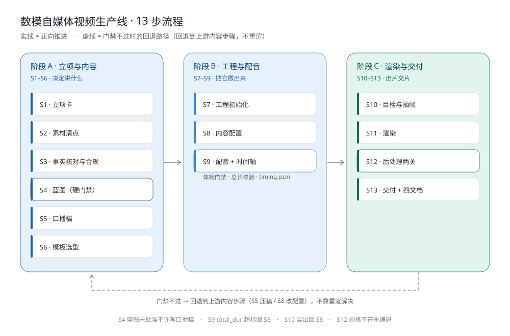
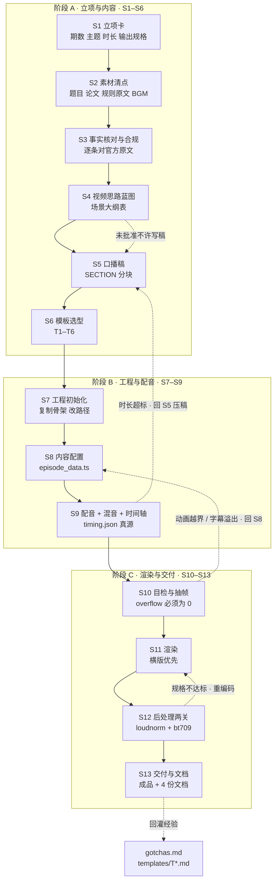
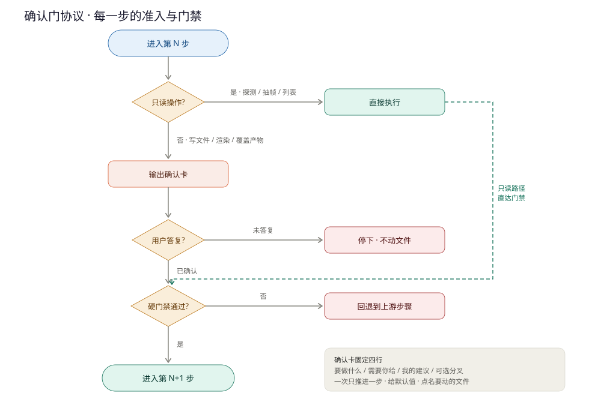
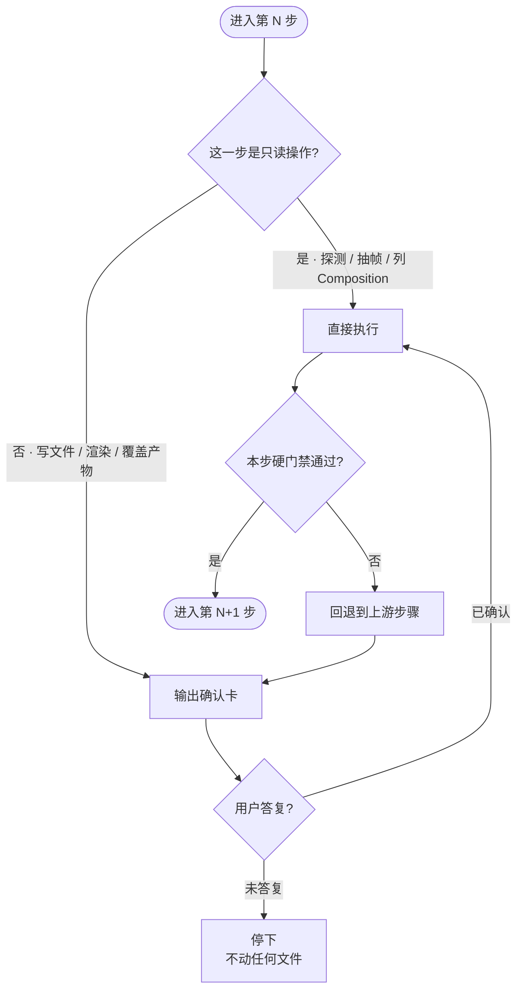
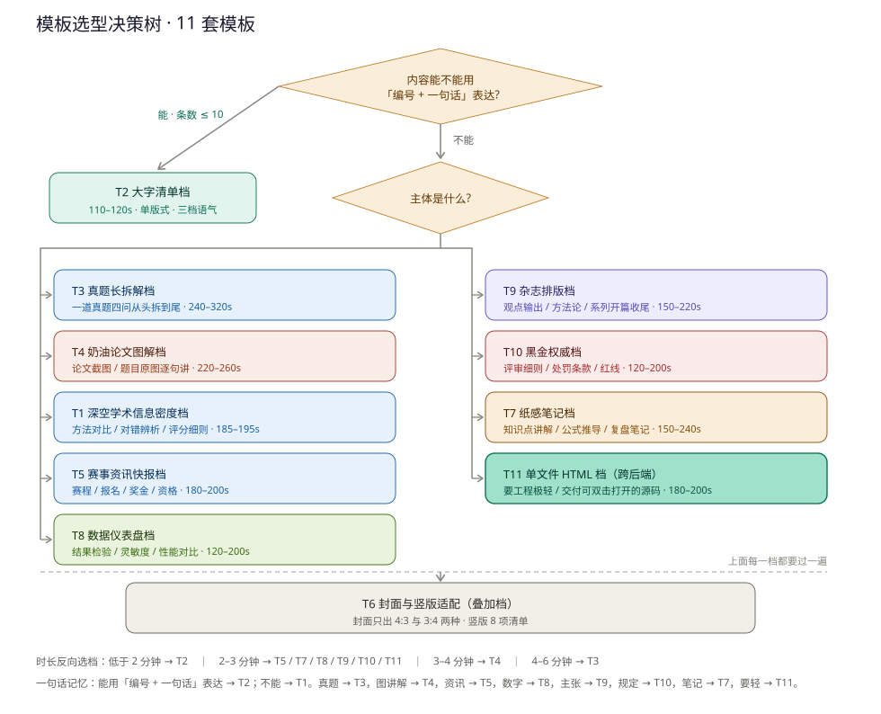
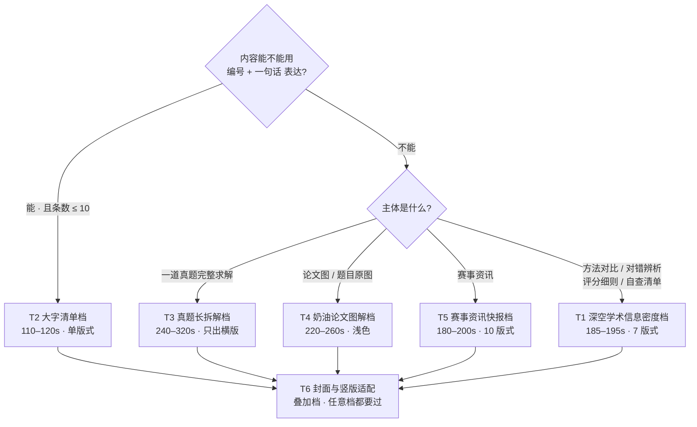
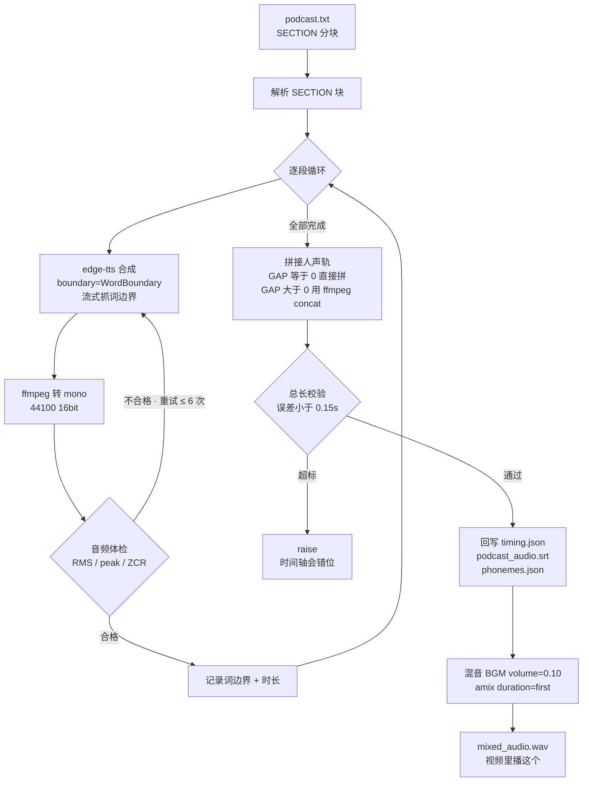
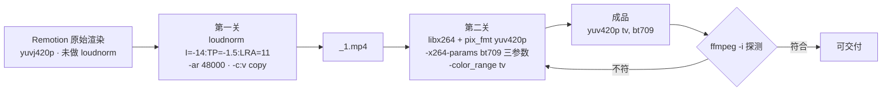
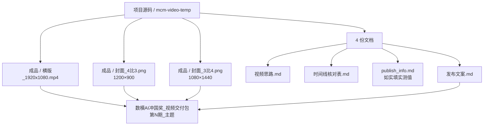

# mcm-video-pipeline

> 数模自媒体视频生产线 · 13 步流程 + 6 套模板 + 强制确认门
> 从 10+ 期已交付视频的实测参数里抽出来的可复用工作流

[English](README.en.md) | **中文**

一套给 AI Agent 用的视频制作 Skill。它不是「提示词合集」，而是把一条真实跑通的视频生产线固化下来：每一步该产出什么、参数是多少、哪一步不能跳、踩过什么坑，全部写死。

所有参数都是**实测值**，来自 `第十二期_论文逐段实战`、`第十三期_交卷之后`、`特别期_A题求解思路`、`特别期_B题开打指南`、`特别期_开赛前8小时`、`特别期_华为杯研赛资讯` 等已交付项目。



---

## 目录

- [它解决什么问题](#它解决什么问题)
- [总体流程](#总体流程)
- [确认门协议](#确认门协议)
- [13 步详解](#13-步详解)
- [模板库](#模板库)
- [配音与时间轴管线](#配音与时间轴管线)
- [交付前必过的两关](#交付前必过的两关)
- [交付物结构](#交付物结构)
- [技术栈与关键参数](#技术栈与关键参数)
- [已知坑](#已知坑)
- [仓库结构](#仓库结构)
- [快速开始](#快速开始)

---

## 它解决什么问题

做一条 3 分钟的数模视频，真正的成本分布是这样的：

| 环节 | 实际耗时 | 返工代价 |
|---|---|---|
| 选题与蓝图 | 30 分钟 | **改大纲 5 分钟** |
| 口播稿 | 1 小时 | 改稿 + 重跑 TTS + 重渲 ≈ 1 小时 |
| 配音与时间轴 | 10 分钟 | 重跑 ≈ 5 分钟 |
| 渲染 | 5–10 分钟 | 重渲 ≈ 10 分钟 |
| 后处理 + 交付 | 30 分钟 | 重做 ≈ 30 分钟 |

**结论：钱花在蓝图，坑埋在后期。** 所以这套流程做了两个设计：

1. **蓝图前移并设为硬门禁** —— S4 没批准，绝不写口播稿。
2. **后期两关设为交付门禁** —— `loudnorm` + `bt709` 没过，不算做完。

---

## 总体流程



### 阶段划分

| 阶段 | 步骤 | 一句话 | 主要产物 |
|---|---|---|---|
| **A · 立项与内容** | S1–S6 | 决定讲什么 | 立项结论、素材清单、事实出处表、`视频思路.md`、`podcast.txt`、选定模板 |
| **B · 工程与配音** | S7–S9 | 把它做出来 | Remotion 工程、`episode_data.ts`、`timing.json`、`mixed_audio.wav` |
| **C · 渲染与交付** | S10–S13 | 出片交片 | probe 帧、横版 mp4、归一化成品、4 份文档 + 交付包 |

---

## 确认门协议

**这是整套流程和普通「提示词模板」最大的区别。**

每一步开始前，Agent 必须先输出一张**确认卡**，等用户答复后才执行。没答复就不动任何文件。





### 确认卡固定四行

```
【S<N> · <步骤名>】
要做什么：<一句话，含会动到哪些文件 / 目录>
需要你给：<① ② ③ 编号列出必填输入；没有必填就写「无」>
我的建议：<默认方案 + 一句理由，让用户回「1」就能过>
可选分叉：<A / B / C，只在真的有选择时写>
```

### 三条附加规则

1. **一次只推进一步。** 不要把 S4–S9 连着跑完再回头问，也不要在同一张卡里塞两个步骤。
2. **给默认值，别开放式提问。** 「要不要压稿到 1040 字？」优于「你想怎么处理时长？」——用户回一个字就能推进。
3. **写文件 / 渲染 / 覆盖产物前，必须在卡里点名路径。** 渲染和 `loudnorm` 是重编码，会覆盖同名文件。

### 例外：免确认的只读操作

读文件、`ffmpeg -i` 探测、`npx remotion compositions` 列表、抽帧到临时目录——这些不用确认，直接做。

---

## 13 步详解

### S1 · 立项卡

**要问用户 8 个字段**（能给默认值就给，让用户改而不是从头填）：

1. 期数 / 主题名（目录命名：`第N期_主题` 或 `特别期_X`）
2. 定位一句话（这期解决观众什么问题）
3. 系列承接（上期讲了什么、本期接哪句、下期预告什么）
4. 时长目标
5. 输出规格（横版必出；竖版默认不出；封面要不要）
6. 配音音色与语速（默认 `zh-CN-YunxiNeural` +28%）
7. 是否赛期内紧急发布（紧急 → 走 T2/T5；不紧急 → 走 T1/T3）
8. 素材从哪来（题目 PDF / 论文 / 代码 / 规则原文 / 网搜）

**时长档位参考（实测）**

| 档 | 时长 | 口播字数 | 场景数 | 模板 |
|---|---|---|---|---|
| 短平快 | 110–120s | 620–700 字 | 8–10 | T2 |
| 系列标准 | 185–195s | 1180–1230 字 | 9–11 | T1 / T5 |
| 长拆解 | 240–320s | 1500–2000 字 | 6–10 | T3 / T4 |

字数预算公式：**中文长句多按 5.6 字/秒，短句多按 6.5 字/秒**，再按 `RATE` 修正（+28% 时字数上限再乘 1.06）。

### S2 · 素材清点

固定检查这几类，产出一张「有 / 缺」清单：

| 类别 | 去哪找 | 落到哪 |
|---|---|---|
| 题目原文 | `*.pdf` → `pdftotext` 或 Read 工具 | `support/problem_brief.md` |
| 论文正文 | `*.docx` → python-docx | 口播稿取材 |
| 论文图 / 截图 | 截图工具、论文导出图 | 工程 `public/` |
| 规则原文 | 官方 PDF、官网 | **必须逐条对** |
| BGM | 任一已交付期的 `public/bgm.mp3`（2,783,814 B，系列通用） | `public/bgm.mp3` |
| 代码 / 结果 | 求解脚本 + 结果 JSON | 数字口径来源 |
| 参考风格 | 已有模板工程 | 复制骨架用 |

**问用户**：缺的素材要不要现在补？还是先按「题面事实 + 合理假设」推进（假设必须写进视频/文案里）？

### S3 · 事实核对与合规

**这一步不能省。** 规则类、官方口径类内容错一个字就可能被杠或被下架。

把要进口播稿的事实列成表：`结论 | 出处 | 原文摘录 | 口径级别`，然后按四级口径处理：

| 级别 | 定义 | 口播写法 |
|---|---|---|
| **题面事实** | 题目 / 规则原文写死的 | 可以直接说死 |
| **本队实算结果** | 自己跑出来的数字 | **必须带**「大约」「实算出来」，不承诺普适 |
| **经验口径** | 行业惯例、往年观察 | **必须带**「通常」「大概」，不当硬规定讲 |
| **官方处罚条款** | 规则里的罚则 | **逐字对原文**，不加强、不外推 |

### S4 · 视频思路蓝图（关键卡点）

写 `视频思路.md`，含 6 节：一句话结论 / 系列承接 / Hero 句 / 钩子设计 / **场景大纲表** / 事实核对表。

**场景大纲表是这份文档的心脏**：

| # | name | 版式 | accent | 内容一句话 |
|---|---|---|---|---|
| 1 | hook | 三连数字 | 红 | 30 分钟 / 56.5 小时 / 17 倍 |
| 2 | chain | route | 橙 | 四问递进链 |
| … | … | … | … | … |

`name` 后面会同时成为 `podcast.txt` 的 `[SECTION:name]` 和 `episode_data.ts` 的 key，**三处必须完全一致**。

**问用户**：场景数 / 顺序要不要调？哪几个场景删不掉？有没有想加的自拟观点？

> **蓝图没批准，绝对不写口播稿。** 改大纲的成本是 5 分钟，改稿 + 重跑 TTS + 重渲的成本是 1 小时。

### S5 · 口播稿

按 `[SECTION:name]` 分块写 `podcast.txt`。**三条硬约定**（违反必返工）：

1. **数字一律中文读法** —— 「百分之四点三」「二零二六年」「二十兆」，不写 `4.3%` / `2026 年` / `20MB`
2. **英文缩写先试听 3 秒样本** —— `MD5` → 「M D 五」，`Robin` → 「罗宾边界」
3. **经验口径加软化词** —— 「大约」「通常」

**超时长处理顺序（不能颠倒）**：先压稿约 7% → 再把 `RATE` 从 `+20%` 提到 `+28%` → 还不够就回 S4 砍场景。
**别只加 rate**，会挤到听不清。

### S6 · 模板选型

按 [模板库](#模板库) 的决策树选一档，读对应 `templates/T*.md` 再执行。

### S7 · 工程初始化

1. 复制骨架到 `<期数>_<主题>/项目源码/mcm-video-temp/`
2. 删掉 `videos/` 里的旧产物，新建 `videos/<新ep名>/`
3. 改三处路径：
   - `src/remotion/consts.ts` → `VIDEO_NAME`
   - `src/remotion/Root.tsx` → `import timingData from "../../videos/<新ep名>/timing.json"`
   - `_gen_tts.py` → `BASE = os.path.join(HERE, "videos", "<新ep名>")`
4. `npm install`（或用 junction 指向已装好的期，省 3–5 分钟）
5. 冒烟：`npx remotion compositions src/remotion/index.ts` —— 能列出 4 个 Composition 就算通

### S8 · 内容配置

改 `episode_data.ts`：`SECTIONS[]` / `VOICE_TEXTS` / `BRAND.corner` / `COVER`。

**门禁**：`podcast.txt` 的 `[SECTION:x]` 集合必须与 `episode_data.ts` 的 key 集合完全相等。

### S9 · 配音 + 混音 + 时间轴

见 [配音与时间轴管线](#配音与时间轴管线)。

**三条门禁，缺一不可**：
1. 打印的 `total_dur=` 落在目标区间（超出 → 回 S5 压稿）
2. 音频体检全过（`RMS<0.20 / peak<0.99 / ZCR<6000 / 时长>0.5s`）
3. 拼接总长与预期差 `<0.15s`（否则时间轴错位）

### S10 · 目检与抽帧

`npx remotion studio` 逐场景看，再用 `npx remotion still --frame=N` 抽 4–5 帧关键位（10% 片头、密集中段 2–3 帧、片尾）。

**检查清单**：字幕不超 3 行、大数字不撞边、清单最后一条能动、竖版正文区不底部留白。

### S11 · 渲染

```bash
npx remotion render src/remotion/index.ts <CompositionId> out/横版.mp4 --gl=angle
npx remotion still  src/remotion/index.ts Cover43        out/封面16x9.png
npx remotion still  src/remotion/index.ts Cover34        out/封面3比4.png
```

`--gl=angle` 走独显；无独显或报错就去掉退回 swangle。渲染日志里 `overflow` 必须为 0。

### S12 · 后处理两关

见 [交付前必过的两关](#交付前必过的两关)。

### S13 · 交付与文档

见 [交付物结构](#交付物结构)。**收尾动作**：

1. 追加工作日志
2. 本次踩到的新坑 → 更新 `references/gotchas.md`
3. 本次做的模板级改动 → 更新对应 `templates/T*.md`

---

## 模板库

6 套模板，**全部有已交付的实测真源**。

| 档 | 文件 | 一句话定位 | 时长 | 场景数 | 实测真源 |
|---|---|---|---|---|---|
| T1 | `templates/T1-深空学术-信息密度.md` | 多版式承载高信息密度，系列正片主力 | 185–195s | 9–11 | 第十二期 189.65s、第十三期 185.40s |
| T2 | `templates/T2-大字清单-紧迫.md` | 单版式大字清单，扫读最快 | 110–120s | 8–10 | 特别期_开赛前8小时 111.51s |
| T3 | `templates/T3-真题长拆解.md` | 一道真题四问从头拆到尾 | 240–320s | 6–10 | 特别期A 286.37s、特别期B 319.10s |
| T4 | `templates/T4-奶油论文图解.md` | 论文截图 / 题目原图逐句讲解，浅色档 | 220–260s | 6 章节 / 30 句 | 真题拆解 242.15s |
| T5 | `templates/T5-赛事资讯快报.md` | 赛程 / 报名 / 奖金 / 资格 资讯速报 | 180–200s | 10 | 华为杯研赛资讯 186s |
| T6 | `templates/T6-封面与竖版适配.md` | **叠加档**，给 T1–T5 补封面 / 竖版 | — | — | 全期通用 |

### 决策树





### 六档视觉差异速查

| 维度 | T1 | T2 | T3 | T4 | T5 |
|---|---|---|---|---|---|
| 底色 | `#070B18` 深空 | `#070B18` 深空（更黑收尾） | 同 T1 | `#FDFBF4` 奶油 | 同 T1 |
| 主色 | 8 色 accent 轮换 | 3 档语气（青/琥珀/红） | 8 色 accent | 蓝 + 黄 + 青 | 8 色 accent |
| 字体 | 大数字/标题宋体，正文黑体 | **全黑体**（无宋体） | 同 T1 | 标题宋体 + 正文黑体 | 同 T1 |
| 背景 | 双径向光晕 + 52px 网格 + 顶底 8px 条 | 单径向光晕（**呼吸**）+ 64px 网格 + 顶部 6px 条 | 同 T1 | 44px 网格 + 顶底 14px 三色条 | 同 T1 |
| 版式数 | 6 + number | **1**（NumberView） | 6 + number | **1**（左文右图） | **10** |
| 字幕 | 句级权重 / 词边界硬切 | **整段** | 词边界硬切 | 逐句条（0.18s 间隙） | 词边界硬切 |
| TTS 音色 | 云希 `YunxiNeural` | 云希 | 云希 | **云健 `YunjianNeural`** | 云希 |
| rate | +20% / +28% | +20% / +30% | **+20%** | **+8%** | +20% |
| 封面 | 三连数字卡 | 2 列网格清单 | 同 T1 | 论文图版 | 同 T1 |

### 混搭规则

用户说「T1 的配色 + T5 的版式」这类混搭时，**先确认三件事**：

1. **时长**：以版式多的那档为准（T5 的 10 版式撑不到 120s，会变成 180–200s）
2. **配色来源**：从哪档拿 `theme.ts`，另一档的 accent 语义色要重新映射（T1 是 8 色，T2 是 3 档语气）
3. **字幕模式**：混搭时只能选一种（句级 / 整段），不能一个视频里两种并存

混搭后要重新算字数预算，并明确告诉用户「这是第一次跑这个组合，版式间距可能需要一轮微调」。

---

## 配音与时间轴管线

`_gen_tts.py` 一条命令做完 4 件事：逐段 TTS（含体检）→ 拼接人声轨 → 混 BGM → 回写时间轴。



### 时间轴是真源

`timing.json` 里每个场景有 `start_sec` / `duration_sec` / `start_frame` / `duration_frames`，以及**每段的句级时刻** `sentences:[{text,start,end}]`。

`Root.tsx` 里 4 个输出的 `durationInFrames` 全部从 `timing.json` 读 —— **重跑配音后自动同步，不用手改**。

### 字幕的两代做法

| 代 | 做法 | 状态 |
|---|---|---|
| 第一代 | 按句长权重估算时段 | 已淘汰，仅老 `timing.json` 兜底 |
| **第二代** | edge-tts `WordBoundary` 词边界实时刻，硬切无动画 | **推荐** |

> ⚠️ 新版 edge-tts 默认 `boundary="SentenceBoundary"`，**必须显式传 `WordBoundary`**，否则 audio 正常但拿到 0 个词事件，字幕失去实时刻。

---

## 交付前必过的两关



```bash
# 第一关：响度归一（-ar 48000 必须写，否则 aac 会被推到 96kHz）
ffmpeg -y -i out/横版.mp4 -af "loudnorm=I=-14:TP=-1.5:LRA=11" -ar 48000 \
  -c:v copy -c:a aac -b:a 192k out/_1.mp4

# 第二关：重编码 + 写 bt709 色彩标签（VUI 只能靠 x264-params）
ffmpeg -y -i out/_1.mp4 -c:v libx264 -pix_fmt yuv420p \
  -x264-params colorprim=bt709:transfer=bt709:colormatrix=bt709 \
  -color_range tv -c:a aac -b:a 192k -ar 48000 \
  -map 0:v -map 0:a out/横版.mp4
```

**验收标准**：`ffmpeg -i out/横版.mp4` 的 video 行必须是 `yuv420p(tv, bt709, progressive)`。

**系列标准**：H.264 + `yuv420p(tv/bt709)` + 30fps + AAC 192kbps + `loudnorm I=-14 LUFS`。

---

## 交付物结构



### 交付前最终核对清单

- [ ] `ffmpeg -i` 探测到 `yuv420p(tv, bt709, progressive)`
- [ ] 音频 AAC 192kbps / 48000 Hz / stereo
- [ ] `loudnorm I=-14` 已应用
- [ ] `timing.json` 的 `total_duration` 与成品时长一致（±0.1s）
- [ ] 封面两张尺寸正确（1200×900 / 1080×1440）
- [ ] `podcast.txt` ↔ `VOICE_TEXTS` ↔ `timing.json` 三处 name 一致
- [ ] 四份文档齐全，`publish_info.md` 已如实填实测值
- [ ] 已进统一交付包，交付包 README 表格已加行
- [ ] 用户已确认标题

---

## 技术栈与关键参数

| 项 | 值 |
|---|---|
| Remotion | 4.0.517 |
| React | 18.3.1 |
| TTS 引擎 | edge-tts（`zh-CN-YunxiNeural` 云希男声为主） |
| rate | `+20%` 基准 / `+28%` 救急 / `+30%` 紧迫档 / `+8%` 慢速讲解档 |
| 音频 | mono 44100 16bit 拼接 → stereo 44100 混音 |
| BGM 音量 | 0.10 |
| 段间静默 GAP | 0（T1 场景即配音）/ 0.18s（T4 逐句）/ 0.35s（T2 大字清单） |
| fps | 30 |
| 输出 | H.264 `yuv420p(tv/bt709)` 30fps + AAC 192kbps |
| 响度 | `loudnorm I=-14:TP=-1.5:LRA=11` |
| 时长目标 | 短平快 110–120s / 标准 185–195s / 长拆解 240–320s |
| 口播字数 | 短平快 620–700 / 标准 1180–1230 / 长拆解 1500–2000 |
| 字速预算 | 5.6 字/秒（长句、中文数字多）～ 6.5 字/秒（短句） |
| 封面尺寸 | 4:3 = 1200×900；3:4 = 1080×1440 |
| 字幕字号 | 横版 38 / 竖版 46（T1）；横版 44 / 竖版 40（T2） |
| 标题字号 | `60 * fontK`，`fontK = isPortrait ? (width/1080)*0.94 : width/1920` |
| 元素交错步长 | 0.09 ~ 0.16；入场时长 0.10 ~ 0.16；**封顶 0.9** |
| 渲染加速 | `--gl=angle`（ANGLE 硬件后端） |

### 动效三条铁律

1. **所有 `interpolate` 必须带 `clamp`**，否则场景边界会画出动画外。
2. **`Math.min(st + dur, 0.9)` 必须封顶** —— 清单 / 图例条目多时，不加封顶会让后面条目永远动不起来。
3. **场景进度用归一化 `p = clamp((sec - start_sec) / duration_sec, 0, 1)`**，不要用绝对时间，这样改时长不用改动画。

---

## 已知坑

18 条实测坑完整版见 [`references/gotchas.md`](references/gotchas.md)。最常踩的 8 条：

| # | 坑 | 修法 |
|---|---|---|
| 1 | `interpolate` 不加 clamp / 不封顶 → 动画越界 | 三条铁律，见上 |
| 2 | TTS 读破数字和英文缩写 | 数字写中文读法；缩写先试听 3 秒 |
| 3 | 只加 rate 救时长 | 先压稿 7%，再提 rate |
| 4 | 忘做 loudnorm | 交付前必过第一关 |
| 5 | 产物是 `yuvj420p` | 第二关重编码 + 写 bt709 |
| 6 | 封面尺寸写错 | 以实物为准：1200×900 / 1080×1440 |
| 7 | `podcast.txt` 显示乱码 | 是控制台编码问题，文件本身 UTF-8 正常 |
| 8 | 规则类表述强于官方原文 | 一律先对官方原文再写进口播稿 |

### 环境前置（Windows 实测）

```powershell
# Python 必须用 3.12 系统版 + 显式挂用户站点（edge-tts 装在这里）
$env:PYTHONPATH = "C:\Users\<用户名>\AppData\Roaming\Python\Python312\site-packages"
& "C:\Program Files\Python312\python.exe" -c "import edge_tts; print('edge_tts OK')"

# 系统 ffmpeg（后处理两关用，Remotion 自带的那个能力受限）
ffmpeg -version
```

> ⚠️ **不要直接用 `python _gen_tts.py`。** 如果 PATH 里第一个 python 是别的版本（比如托管运行时），会直接 `ModuleNotFoundError: No module named 'edge_tts'`。必须指定解释器并设 `PYTHONPATH`。

### Remotion 自带 ffmpeg 的两个限制

1. **`-color_trc` / `-colorspace` CLI 参数不写入 VUI** → 必须走 `-x264-params colorprim=bt709:transfer=bt709:colormatrix=bt709`；`range=limited` 不是合法 x264 参数，范围用 `-color_range tv`。
2. **不支持 `loudnorm print_mode=summary` / `volumedetect`** → 要精确复测 LUFS 得用系统 ffmpeg。

---

## 仓库结构

```
mcm-video-pipeline/
├─ README.md                      ← 你正在看的这份
├─ SKILL.md                       ← Agent 主入口：13 步 + 确认门协议
├─ references/
│  ├─ pipeline.md                 全流程技术规格、参数速查、动效语法
│  ├─ gotchas.md                  环境前置 + 18 条实测坑
│  ├─ script-and-compliance.md    口播稿规则与合规红线
│  └─ delivery.md                 4 份交付文档模板
├─ templates/
│  ├─ README.md                   模板选用决策树
│  ├─ T1-深空学术-信息密度.md
│  ├─ T2-大字清单-紧迫.md
│  ├─ T3-真题长拆解.md
│  ├─ T4-奶油论文图解.md
│  ├─ T5-赛事资讯快报.md
│  └─ T6-封面与竖版适配.md
├─ docs/
│  └─ flowcharts.md               全部流程图 + Mermaid 源码
├─ tools/
│  ├─ validate-mermaid.mjs        用官方解析器校验 Mermaid 语法
│  ├─ raster-svg.mjs              把 SVG 光栅化成 PNG 以便目检
│  └─ README.md                   为什么要校验、怎么用、实现上的两个坑
└─ assets/
   ├─ 01-pipeline-overview.svg    总体流程
   ├─ 02-gate-protocol.svg        确认门协议
   └─ 03-template-decision-tree.svg  模板决策树
```

### 推送前建议先过一遍图表校验

仓库里有 19 个 Mermaid 块和 3 张手写 SVG。Mermaid 节点标签里的**裸尖括号**（如 `RMS<0.20`、`GAP>0`）会被 GitHub 当成 HTML 标签，**整块图渲染失败**。用 `tools/` 里的脚本先验一遍：

```bash
npm install mermaid jsdom @resvg/resvg-js
node tools/validate-mermaid.mjs .        # 19/19 通过才算过
node tools/raster-svg.mjs . _preview     # 打开 _preview/ 目检一遍
```

细节见 [`tools/README.md`](tools/README.md)。

---

## 快速开始

### 作为 Agent Skill 使用

把 `SKILL.md` + `references/` + `templates/` 放进你的 Agent 技能目录：

```bash
git clone https://github.com/<你的用户名>/mcm-video-pipeline.git

# WorkBuddy / CodeBuddy 用户级技能目录
cp -r mcm-video-pipeline ~/.workbuddy-ai/skills/mcm-video-pipeline

# 其他 agent 工具
cp -r mcm-video-pipeline ~/.agents/skills/mcm-video-pipeline
```

### 触发方式

对 Agent 说：

- 「做第 14 期，主题是 XXX」→ 从 S1 立项开始走
- 「用 T3 做一期真题拆解」→ 直接跳到 S6 模板选型
- 「重跑配音」→ 只走 S9
- 「封面改一版」→ 只走 S8 + S11

Agent 会在每一步开始前给你一张确认卡，你答复后才动文件。

---

## License

MIT
