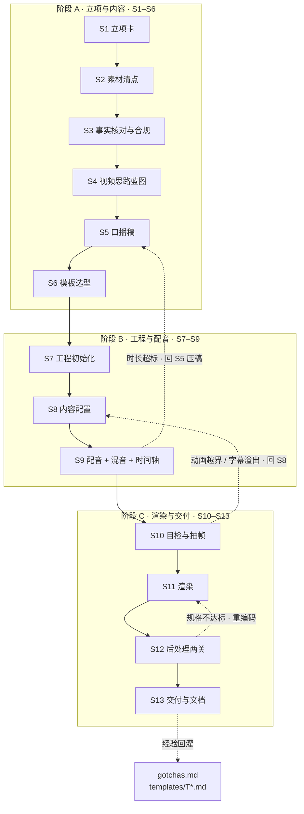
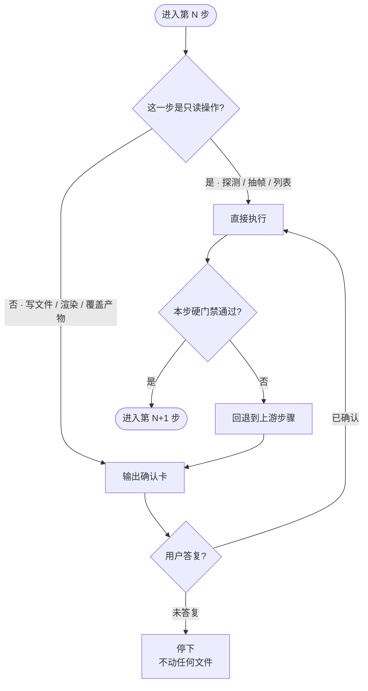
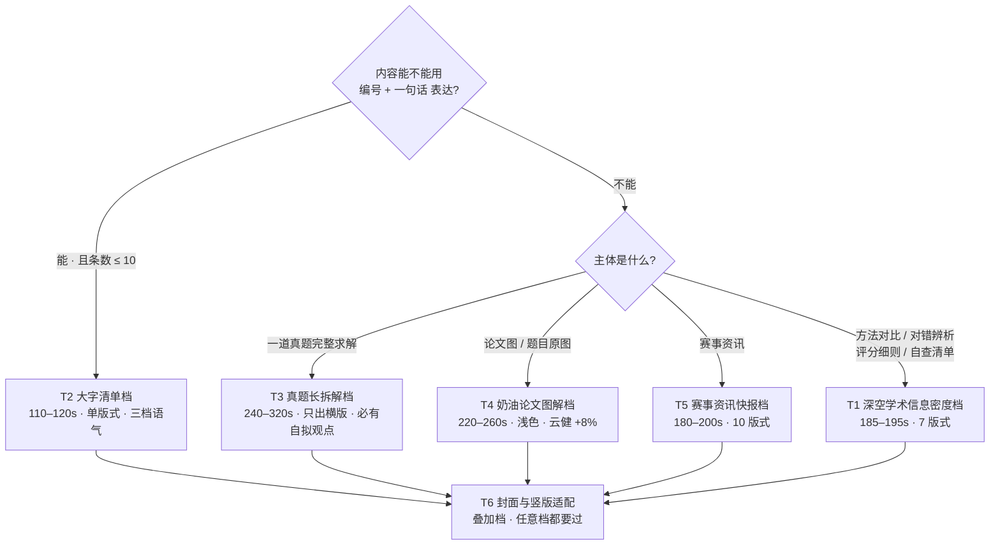
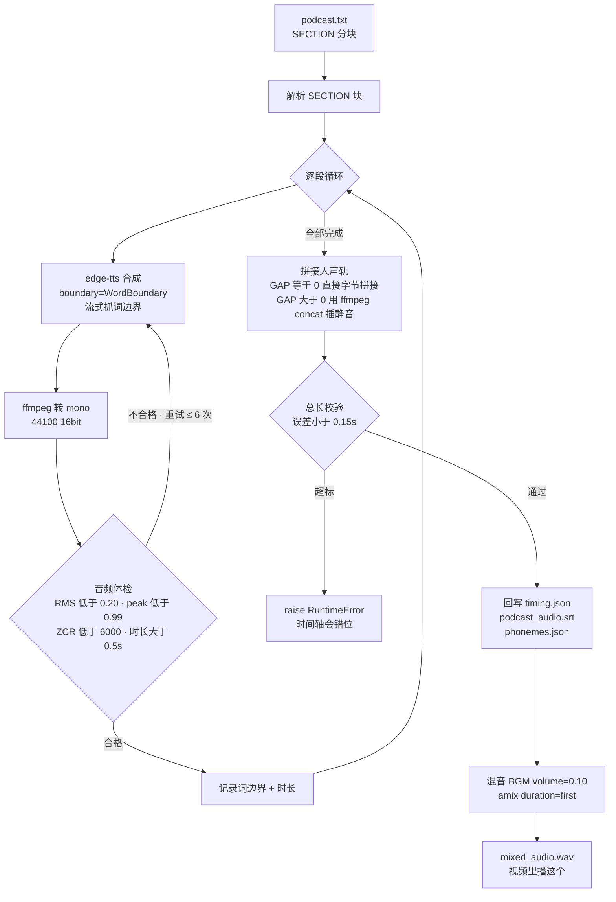
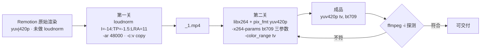
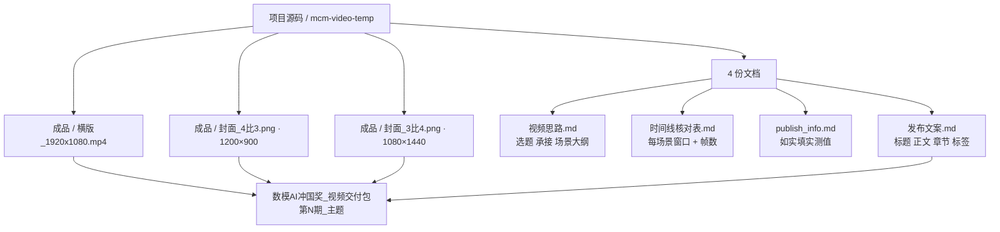
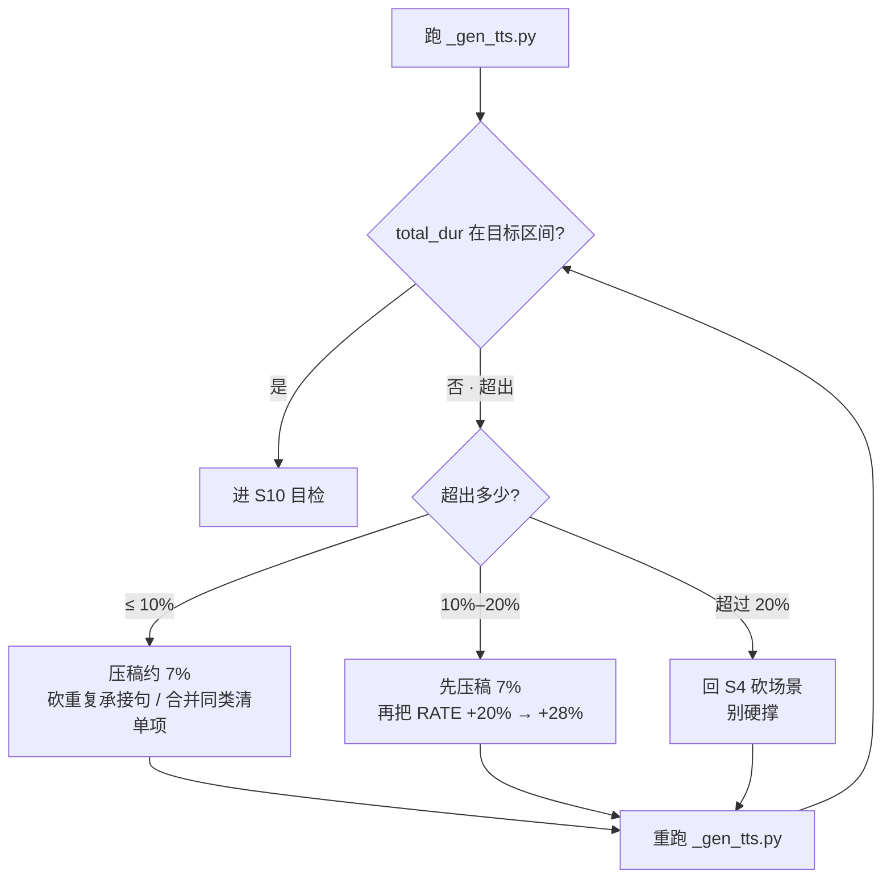
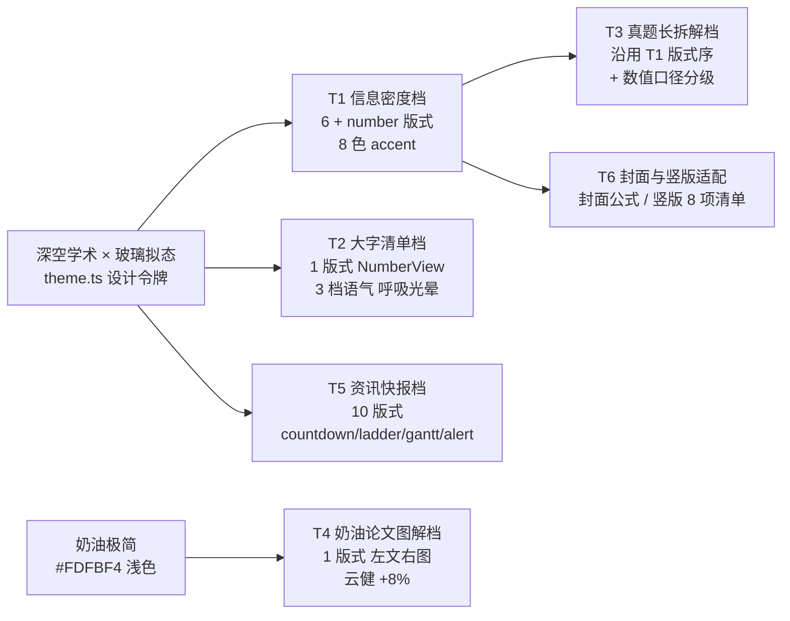

# 流程图全集

本文件集中放这套流程的**全部流程图**，含可直接复制的 Mermaid 源码。
需要单张矢量图（放进 PPT / 视频）时用 `assets/` 下的 SVG。

| # | 图 | 用途 | 对应步骤 |
|---|---|---|---|
| 1 | [总体流程](#1-总体流程) | 一眼看清 13 步与阶段划分 | S1–S13 |
| 2 | [确认门协议](#2-确认门协议) | 每一步的准入与门禁逻辑 | 全流程 |
| 3 | [模板选型决策树](#3-模板选型决策树) | 选哪一档模板 | S6 |
| 4 | [配音与时间轴管线](#4-配音与时间轴管线) | `_gen_tts.py` 内部流程 | S9 |
| 5 | [后处理两关](#5-后处理两关) | 交付前的编码链 | S12 |
| 6 | [交付物汇聚](#6-交付物汇聚) | 产物怎么归集 | S13 |
| 7 | [时长超标回退路径](#7-时长超标回退路径) | 超时了怎么救 | S5 / S9 |
| 8 | [风格 DNA 继承关系](#8-风格-dna-继承关系) | 6 档模板的血缘 | S6 |

---

## 1. 总体流程



**读法**：实线是正向推进，虚线是回退路径。
注意所有回退都指向**上游的内容步骤**（S5 / S8），而不是重渲——这是「蓝图前移」设计的直接结果。

**阶段产出对照**

| 阶段 | 步骤 | 核心产物 | 完成标志 |
|---|---|---|---|
| A | S1–S6 | `视频思路.md`、`podcast.txt`、选定模板 | 蓝图与稿件用户已确认 |
| B | S7–S9 | 可跑工程、`episode_data.ts`、`timing.json`、`mixed_audio.wav` | `total_dur` 落在目标区间 |
| C | S10–S13 | probe 帧、横版 mp4、归一化成品、4 份文档 | `ffmpeg -i` 显示 `yuv420p(tv, bt709)` |

---

## 2. 确认门协议



**四个分支的含义**

| 分支 | 条件 | 行为 |
|---|---|---|
| 只读 → 直接执行 | 读文件、`ffmpeg -i`、列 Composition、抽帧到临时目录 | 不打断用户 |
| 写操作 → 先出确认卡 | 写文件、渲染、覆盖产物 | 必须等答复 |
| 未答复 | — | 停手，不动任何文件 |
| 硬门禁不过 | 时长超标 / 体检不过 / 规格不符 | 回退到上游，**不回退到重渲** |

### 确认卡模板

```
【S<N> · <步骤名>】
要做什么：<一句话，含会动到哪些文件 / 目录>
需要你给：<① ② ③ 编号列出必填输入；没有必填就写「无」>
我的建议：<默认方案 + 一句理由，让用户回「1」就能过>
可选分叉：<A / B / C，只在真的有选择时写>
```

---

## 3. 模板选型决策树



**一句话记忆**：能不能用「编号 + 一句话」表达？**能 → T2，不能 → T1。** 真题 → T3，图讲解 → T4，资讯 → T5。

**时长校验**（用户先给了时长时反向选档）

| 用户要的时长 | 选档 |
|---|---|
| < 2 分钟 | T2（其他档撑不到那么短） |
| 2–3 分钟 | T5，或 T1 压到 185s |
| 3–4 分钟 | T4 |
| 4–6 分钟 | T3 |

---

## 4. 配音与时间轴管线



**三个关键点**

1. **体检门禁是必须的** —— edge-tts 会**间歇性**返回损坏数据（RMS 飙到 0.4+、削波、过零率翻 5 倍），不体检一次抖动就毁整条音轨。
2. **必须显式要词边界** —— `Communicate(..., boundary="WordBoundary")`。新版默认 `SentenceBoundary`，不传就拿到 0 个词事件。
3. **总长校验兜底** —— 拼接后实测总长与预期差 > 0.15s 直接 `raise`，不让错位的时间轴流到渲染。

**GAP 参数按档位不同**

| 档 | GAP | 理由 |
|---|---|---|
| T1 / T3 / T5 | 0 | 场景即配音，场景边界就是语音边界 |
| T4 | 0.18s | 逐句拼接，句间留气口增强自然感 |
| T2 | 0.35s | 段间静默让旧场景自然淡出 |

---

## 5. 后处理两关



**为什么必须两步**

| 关 | 解决什么 | 不做的后果 |
|---|---|---|
| 第一关 | 音量归一到系列标准 -14 LUFS | 同系列音量跳变（第十二期就漏了） |
| 第二关 | 像素格式转 `yuv420p` + 写 bt709 色彩标签 | 产物是 `yuvj420p`，B 站能播但规格不干净 |

**两个易错点**

- `-ar 48000` 必须写，否则 Remotion 的 ffmpeg 会把 aac 推到 **96kHz**。
- 色彩标签只能靠 `-x264-params` 写，CLI 的 `-color_trc` / `-colorspace` 在 Remotion ffmpeg 上**不生效**；`range=limited` 不是合法 x264 参数，范围用 `-color_range tv`。

---

## 6. 交付物汇聚



**工程内产物名 → 交付包名对照**（别搞混）

| 工程内 | 成品目录 | 交付包内 |
|---|---|---|
| `landscape_with_bgm.mp4` | `横版_1920x1080.mp4` | `landscape_with_bgm.mp4` |
| `portrait_with_bgm.mp4` | `竖版_1080x1920.mp4` | （不进交付包） |
| `cover43.png` | `封面_4比3.png` | `封面16x9.png` |
| `cover34.png` | `封面_3比4.png` | `封面3比4.png` |

---

## 7. 时长超标回退路径

这是整条流程里最常走的回退分支，单独画一张。



**实测参考**

| 期 | 初稿 | 目标 | 处理 | 落地 |
|---|---|---|---|---|
| 第十二期 | +20% 实测 221s | 190s | 精简约 7% + rate 提到 +28% | 189.65s |
| 第十三期 | 1410 字实测 217.8s | 185–195s | 压到约 1040 字 | 185.28s |

> **别只加 rate。** 文案不动只提语速，会挤到听不清；而且 rate 越高，TTS 读破中文数字的概率越大。

---

## 8. 风格 DNA 继承关系



**读法**

- **T1 是主干**：T3、T5、T6 都从它派生。要改配色 / 字体 / 动效语法，改 `theme.ts` 一处，T1/T3/T5 一起变。
- **T2 是主干的分支**：共用深空底色，但把「8 色 accent」简化成「3 档语气」，换场景只换一个 `tone`，认知成本更低。
- **T5 是 T1 的版式扩充**：同一套骨架，多了 `countdown` / `timeline` / `ladder` / `gantt` / `alert` 五个资讯类版式。
- **T4 是独立血统**：浅色奶油底 + 云健音色 + 慢速 +8% + 句子索引硬编码章节，跟深空系没有共用代码。
